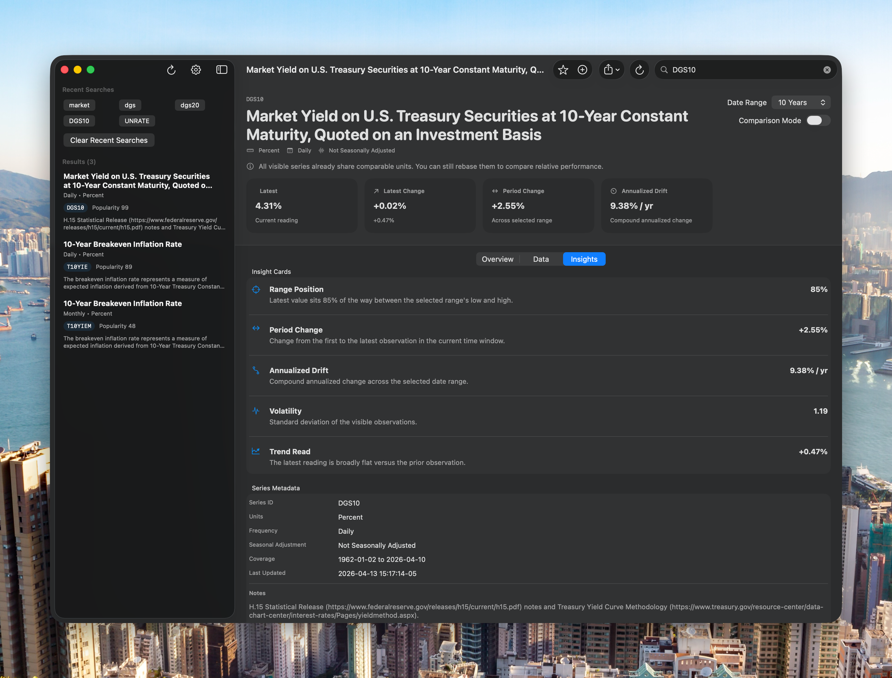
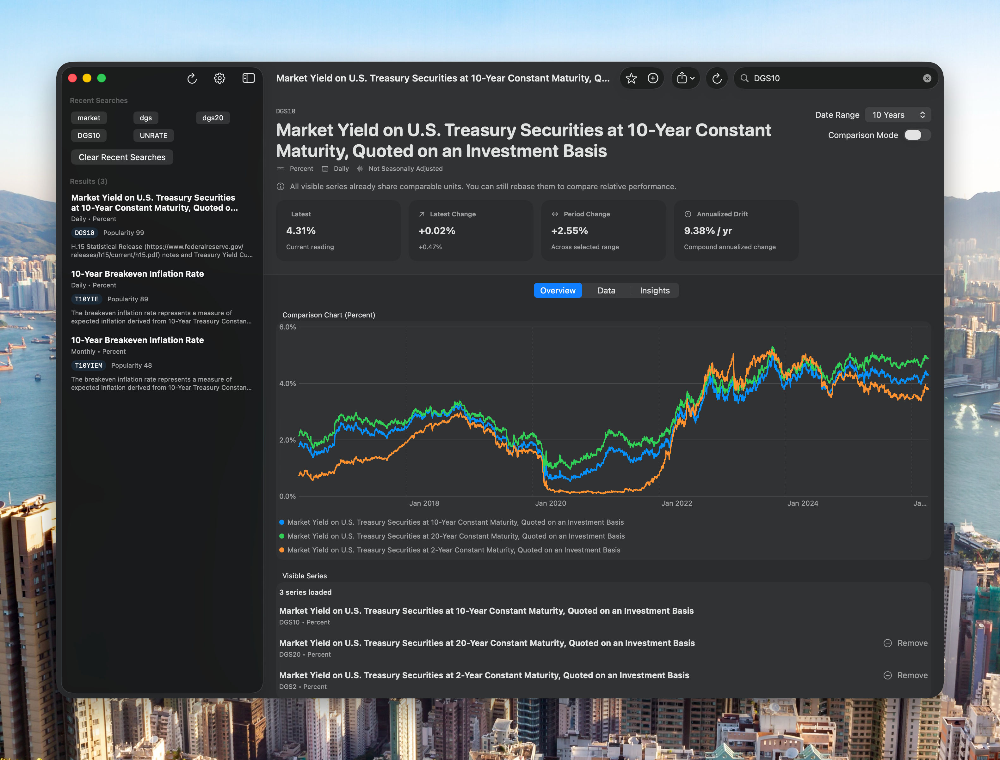

# FREDCharts

A native macOS desktop app for searching, comparing, and exporting Federal Reserve Economic Data (FRED) time-series. Built with SwiftUI and Swift Charts.


---

## 功能简介 | About

**FRED Ultra** 是一款专为经济研究设计的 macOS 原生桌面应用，可搜索、对比和导出圣路易斯美联储银行（St. Louis Fed）的 FRED 经济数据集。

### 主要功能 | Key Features

- **首次使用引导** — 输入并验证 FRED API Key，解锁完整功能
- **经济数据搜索** — 支持防抖搜索、近期查询和收藏序列
- **序列详情仪表板** — 包含关键指标（最新值、变化、期间变化、年化漂移）、交互式图表、原始观测数据表和洞察卡片
- **多序列对比** — 对比模式下可将不同单位的序列统一基准为 100，便于诚实比较
- **数据导出** — 支持 CSV 和 JSON 格式导出
- **剪贴板复制** — 一键复制可见数据
- **统一日志** — 覆盖搜索、详情加载、导出和收藏操作的日志记录

---

## 系统要求 | Requirements

- macOS 15 (Sequoia) 或更新版本
- Xcode 16 或更新版本（本地开发）
- 免费 FRED API Key： [申请地址](https://fred.stlouisfed.org/docs/api/api_key.html)

---

## 项目结构 | Project Structure

```
FRED-Ultra/
├── FRED-Ultra/
│   ├── Models/
│   │   └── FREDModels.swift          # 数据模型、展示模型、格式化工具
│   ├── Services/
│   │   └── FREDService.swift          # API 服务、设置管理、导出服务
│   ├── Support/
│   │   └── AppLogger.swift            # 统一日志基础设施
│   ├── ViewModels/
│   │   ├── SearchViewModel.swift      # 搜索生命周期与状态
│   │   └── SeriesDetailViewModel.swift # 观测数据、对比、统计、导出
│   ├── Views/
│   │   ├── SeriesDetailView.swift     # 序列详情界面（概览/数据/洞察）
│   │   └── SettingsView.swift         # API Key 验证与本地数据管理
│   ├── ContentView.swift              # 根视图：引导/侧边栏/详情工作区
│   └── FRED_UltraApp.swift            # 应用入口、菜单命令、生命周期
├── FRED-UltraTests/                    # 单元测试
├── FRED-UltraUITests/                 # UI 测试
├── script/build_and_run.sh            # 构建与运行脚本
├── init.sh                            # 项目健康检查脚本
└── handoff.md                         # 交接文档
```

---

## 核心架构 | Architecture

### 数据流

```
用户输入 API Key
       ↓
SettingsManager (UserDefaults 持久化)
       ↓
FREDService (Actor, 网络请求)
       ↓
ViewModels (SearchViewModel / SeriesDetailViewModel)
       ↓
SwiftUI Views (ContentView / SeriesDetailView / SettingsView)
```

### 关键组件

| 文件 | 职责 |
|------|------|
| `FRED_UltraApp.swift` | 应用入口、⌘R 刷新、⇧⌘E 导出、Data 菜单 |
| `ContentView.swift` | 无 API Key 显示引导视图；有 API Key 显示侧边栏+详情工作区 |
| `FREDModels.swift` | FRED API 模型、图表/表格展示模型、导出枚举、统计/洞察类型 |
| `FREDService.swift` | UserDefaults-backed 设置管理器、async FRED API 客户端、导出服务 |
| `SearchViewModel.swift` | 防抖搜索、加载状态、近期查询持久化 |
| `SeriesDetailViewModel.swift` | 观测数据加载、基准化图表数据、统计计算、洞察生成、导出 |
| `SeriesDetailView.swift` | 概览/数据/洞察三个标签页，支持多序列对比 |
| `SettingsView.swift` | API Key 验证（测试后保存）、本地数据管理 |

---

## 运行方式 | Running the App

### Xcode

1. 打开 `FRED-Ultra.xcodeproj`
2. 选择 `FRED-Ultra` scheme
3. Build and Run (⌘R)

### 终端

```bash
# 构建并运行
./script/build_and_run.sh

# 仅验证能否启动
./script/build_and_run.sh --verify

# 实时查看应用日志
./script/build_and_run.sh --logs
```

---

## 验证命令 | Verification Commands

```bash
# 构建
xcodebuild -project FRED-Ultra.xcodeproj -scheme FRED-Ultra -sdk macosx build

# 运行单元测试
xcodebuild -project FRED-Ultra.xcodeproj -scheme FRED-Ultra -sdk macosx test -only-testing:FRED-UltraTests

# 项目健康检查
./init.sh
```

---

## 键盘快捷键 | Keyboard Shortcuts

| 快捷键 | 功能 |
|--------|------|
| ⌘R | 刷新当前序列详情视图 |
| ⇧⌘E | 从当前序列详情视图导出 CSV |
| ⌘, | 打开设置 |

---

## 界面预览 | Screenshots

### 工作区引导


首次打开应用时显示欢迎视图，引导用户输入 FRED API Key。

### 研究桌面





完成 API Key 验证后进入研究桌面，可进行搜索、对比和数据分析。

---

## 数据存储 | Data Storage

- **API Key** — 存储于本机 `UserDefaults`，键名 `FRED_API_KEY`
- **收藏序列** — 存储于本机 `UserDefaults`，键名 `FRED_FAVORITES`
- **近期搜索** — 存储于本机 `UserDefaults`，键名 `FRED_RECENT_SEARCHES`（最多 12 条）

应用仅与官方 FRED API 通信，不上传任何数据至第三方服务器。

---

## 统计指标说明 | Statistics Explained

| 指标 | 说明 |
|------|------|
| Latest | 当前最新读数 |
| Latest Change | 相比上一期的绝对变化 |
| Period Change | 选中时间范围内的总变化 |
| Annualized Drift | 复合年化变化率 |

对比模式（Comparison Mode）会将每个序列的起始值基准化为 100，使不同单位的序列可以公平比较。

---

## 注意事项 | Notes

- 需要 macOS 15 或更新版本
- GitHub remote 未在仓库中配置，如需推送请自行添加 remote
- API Key 不会上传至任何第三方，仅用于访问官方 FRED API
- 应用日志通过 `os.log` 输出，可通过 `script/build_and_run.sh --logs` 查看
